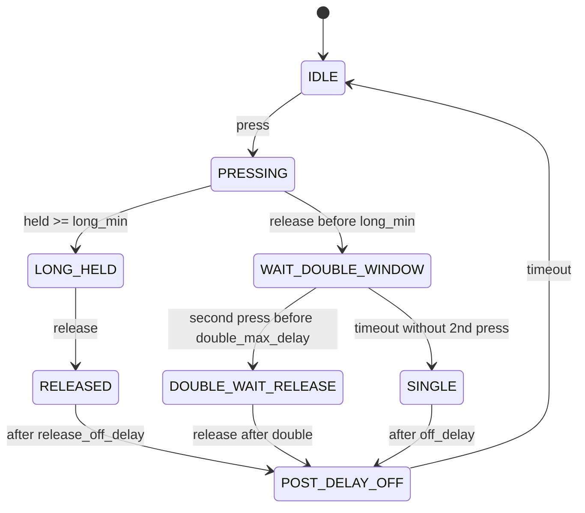

# Domodreams MCP23017 ESPHome Component

This is a custom ESPHome component for handling MCP23017 I/O expanders as
**button/gesture processors** with debouncing, single/double/long click detection,
release detection, optional "off" delays, failure guards, and flexible configuration.

---

## Features

- Supports **multiple MCP23017 chips** on the same I²C bus.
- Each instance exposes 16 pins as **text sensors** (optional, can be autogenerated).
- Per-pin **debouncing** and **gesture recognition** (single, double, long, released, "off").
- Configurable timings:
  - `debounce`
  - `long_min`
  - `double_max_delay`
  - `off_delay`
  - `release_off_delay`
- Per-pin **overrides** for `long_min`, `double_max_delay`, `off_delay`.
- Configurable per-instance **words** for states (`word_off`, `word_single`, `word_double`, `word_long`, `word_released`).
- Automatic creation of sensors if none are declared, with generated IDs/names.
- Guard logic: after 3 consecutive I²C read failures, all pins publish `"off"` and the component is marked failed (optional reboot).
- FSM gesture trigger: `on_fsm_change` with variables available in lambda:
  - `pin` (0–15)
  - `name` (sensor name, if defined)
  - `prev_state`
  - `state`
  - `time` (millis since boot)
  - `unixtime` (RTC-based, or millis-derived fallback)

---

## FSM (Gesture State Machine)

### States
- **IDLE**
- **PRESSING**
- **WAIT_DOUBLE_WINDOW**
- **LONG_HELD**
- **DOUBLE_WAIT_RELEASE**
- **POST_DELAY_OFF**

### Gestures
- `"off"` → default/rest state
- `"single"` → short press, no second press within `double_max_delay`
- `"double"` → two presses within `double_max_delay`
- `"long"` → press held at least `long_min`
- `"released"` → after a `long`, when button is released

### Diagram (Mermaid)



---

## YAML Configuration

### Minimal Example (auto sensors)
```yaml
i2c:
  sda: 13
  scl: 16
  scan: true

text_sensor:
  - platform: domodreams_mcp23017
    id: mcp1
    address: 0x20
```

This generates 16 sensors named `mcp1 0x20 MCP Pin 0` … `Pin 15`.

---

### Example 1 — Per-instance defaults
```yaml
text_sensor:
  - platform: domodreams_mcp23017
    id: mcp1
    address: 0x20
    debounce: 50
    long_min: 1000
    double_max_delay: 300
    off_delay: 100
    release_off_delay: 1000
    word_off: "off"
    word_single: "single"
    word_double: "double"
    word_long: "long"
    word_released: "released"
```

---

### Example 2 — With explicit sensors and overrides
```yaml
text_sensor:
  - platform: domodreams_mcp23017
    id: mcp2
    address: 0x21
    debounce: 50
    long_min: 1000
    double_max_delay: 300
    off_delay: 200
    sensors:
      - name: Pin0 SingleOnly
        pin: 0
        long_min: 0
        double_max_delay: 0
      - name: Pin1 LongOnly
        pin: 1
        long_min: 2000
        double_max_delay: 0
        off_delay: 500
      - name: Pin2 DoubleFast
        pin: 2
        double_max_delay: 150
```

---

### Example 3 — Using FSM trigger
```yaml
text_sensor:
  - platform: domodreams_mcp23017
    id: mcp3
    address: 0x22
    debounce: 30
    long_min: 800
    double_max_delay: 250
    off_delay: 200

    on_fsm_change:
      then:
        - lambda: |-
            ESP_LOGI("fsm", "FSM change: pin=%d name=%s prev=%s -> state=%s time=%u unixtime=%llu",
                     pin,
                     name.c_str(),
                     prev_state.c_str(),
                     state.c_str(),
                     time,
                     (unsigned long long) unixtime);
```

---

## TODO

- Add binary_sensor variant (direct HIGH/LOW exposure).
- Evaluate performance at >8 MCP chips (scaling tests).
- Optimize I²C batch reads for multiple instances.
- Consider per-pin `released` delay overrides.

---
