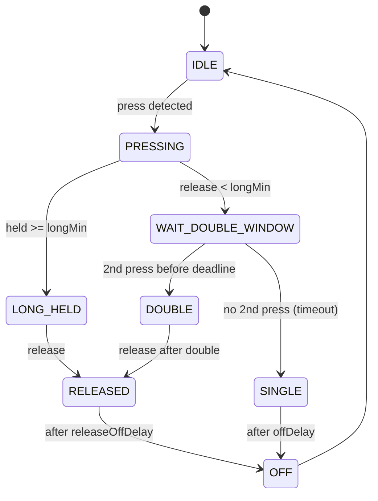

# Domodreams MCP23017 for ESPHome

Custom ESPHome component to manage one or more MCP23017 I/O expanders.  
Designed for **button/keyboard-like inputs** with robust **debounce** and a flexible **state machine** supporting gestures:

- **single**
- **double**
- **long**
- **released**
- **off**

Includes error guards, failure streak handling, and optional reboot-on-fail.

---

## ✨ Features

- Up to **16 inputs per MCP23017**, with support for multiple chips on the same I²C bus.
- Per-pin **debounce** (ms).
- **Gesture FSM**:
  - Single press
  - Double press (configurable delay, can be disabled globally or per-pin)
  - Long press (minimum duration configurable)
  - Released
  - Automatic `off` after configurable delay
- **Initial states** (`off`) published on boot to avoid `unknown` in Home Assistant.
- **I²C Guard**:  
  - 3 consecutive failures → all pins forced to `off` and component marked failed.
  - Optional reboot on fail (`reboot_on_fail: true`).
- **Last triggered sensors**:
  - `last_triggered_button`: name of the last triggered pin
  - `last_triggered_time`: ISO timestamp (if time source present), else ms since boot.

---

## ⚙️ Configuration

Example ESPHome YAML:

```yaml
external_components:
  - source:
      type: local
      path: components
    components: [domodreams_mcp23017]

i2c:
  id: i2c_bus_1
  sda: 13
  scl: 16
  scan: true
  frequency: 100kHz

time:
  - platform: homeassistant
    id: homeassistant_time

text_sensor:
  - platform: template
    id: last_btn
    name: "Last Triggered Button"
  - platform: template
    id: last_time
    name: "Last Triggered Time"

  - platform: domodreams_mcp23017
    id: mcp1
    i2c_id: i2c_bus_1
    address: 0x20
    debounce: 50
    long_min: 1000
    double_max_delay: 300
    off_delay: 100
    release_off_delay: 1000
    update_interval: 10ms
    reboot_on_fail: false
    time_id: homeassistant_time
    last_triggered_button: last_btn
    last_triggered_time: last_time
    sensors:
      - name: MCP1 Pin 0
      - name: MCP1 Pin 1
      - name: MCP1 Pin 2
      # ...
      - name: MCP1 Pin 15
```

---

## 📊 States

Each pin can publish these text values:

- `single`
- `double`
- `long`
- `released`
- `off`

---

## 🔒 Reliability

- All pins publish `off` immediately after boot (avoids `unknown` in HA).
- On I²C failure streak ≥ 3, component fails cleanly with **reason string** (e.g. `"I/O failed at 0x20"`).
- Optional reboot after failure, useful for recovering a stuck bus.

---

## 🛠️ Development Notes

- FSM and debounce are **separated**:
  - `runDebounce()` ensures only clean edges reach FSM.
  - FSM handles gestures and timers.
  - `publishPin()` isolates output publishing.
- Logging can be tuned:  
  - `DEBUG`: publishes state transitions.  
  - `VERBOSE`: includes raw debouncing logs.

---

## 📈 Performance

- With 4 MCP23017 chips @ 100 kHz I²C:
  - Loop time ≈ **11–12 ms** (with `web_server` disabled).
  - Heap free ≈ **195 KB** (ESP32 @ 160 MHz).
- Adding more MCP23017s scales linearly in I²C traffic; keep `update_interval` ≥ 10 ms.

---

## 🚨 Limitations

- No interrupt support (polling only).
- Current implementation assumes **active-low buttons** (inputs inverted via IPOL).
- Double-click detection requires `double_max_delay > 0`.

---

## 📌 To-Do / Ideas

- [ ] Add **per-pin overrides** (debounce, double delay, etc.).
- [ ] Add **event triggers** for ESPHome automations.
- [ ] Expose optional **binary_sensor** outputs in addition to text states.
- [ ] Consider adding **output mode** (drive MCP pins).

---

## 🎯 State Machine Diagram



---

## 🖋️ License

Custom work-in-progress for **Domodreams** project.  
Use, fork, and adapt freely.
